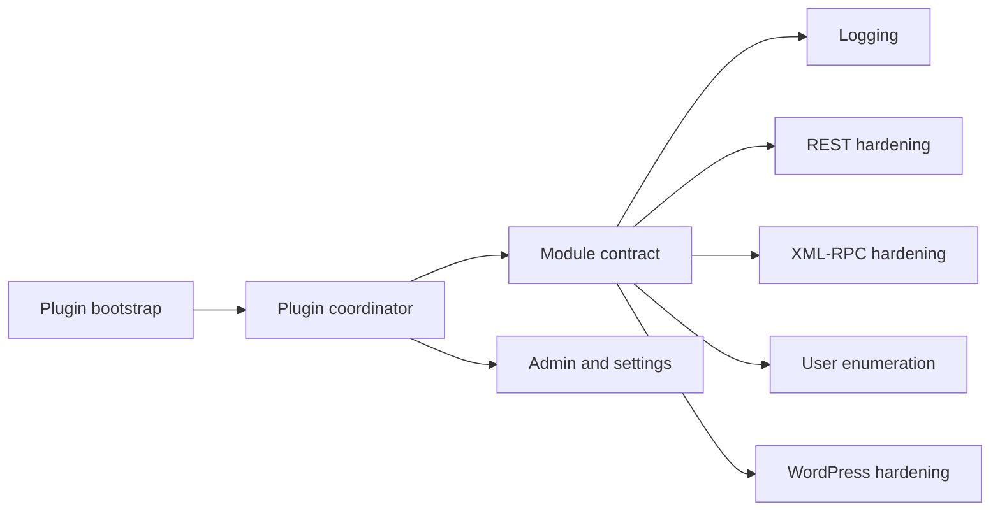

# Architecture

The bootstrap defines plugin constants, loads Composer, and starts the plugin
coordinator. The coordinator receives modules through the `wpht_modules`
filter, so a new module can be added without changing existing modules.

All behavior-changing modules are opt-in. SQL access for security events is
confined to the logging subsystem.
